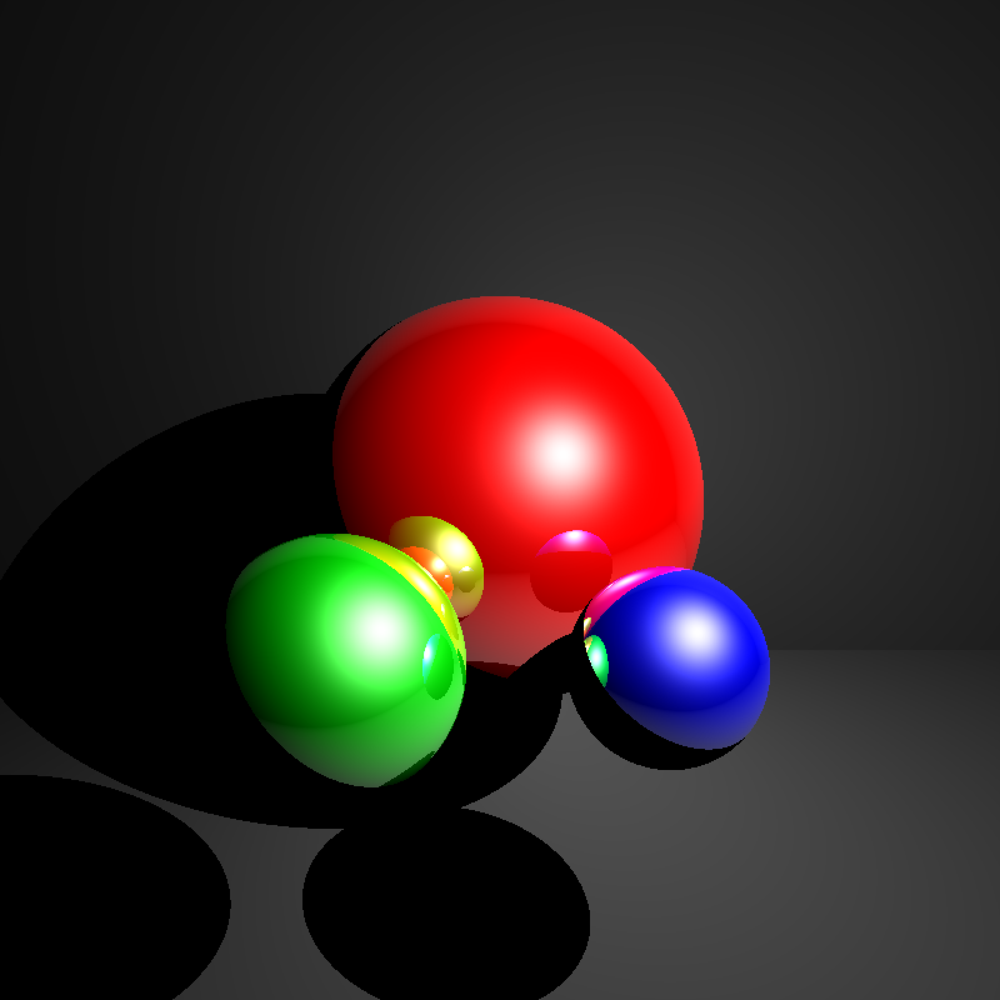

# RayTracing

Simple Ray Tracer implemented in Python. Mostly NumPy. The implementation is pretty naive but there is some functionality for multi-processing which helps. It is object-oriented in order to allow for easy extensibility. For example, after implementing spherical objects, it was really quick to create another Object subclass for planes.

The Ray Tracer uses the Blinn-Phong model for specular shading. It also has diffuse and ambient shading. Each ray can 'bounce' a certain amount of times, leading to mirror finishes if the object properties allow for it (obj.reflection setting).

Future improvements can include various optimizations on vector computations, along with a rewrite of some methods to take more advantage of the NumPy library.

